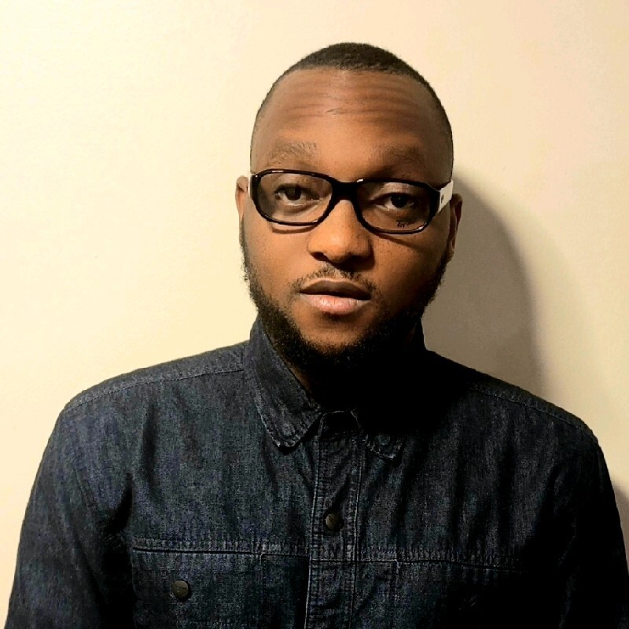

```{r setup, include=FALSE}
knitr::opts_chunk$set(echo = FALSE)
```


## Principal Investigator

### Sunandan Chakraborty

<div class="wrapper">
<div>
</img>
</div>
<div>
Sunandan Chakraborty is an assistant professor of Data Science at IUPUI. 

* [Google Scholar](https://scholar.google.com/citations?user=SlAPvswAAAAJ&hl=en)

</div>
</div>


## Graduate Research Assistants

### Palak Jain

<div class="wrapper">
<div>
</img>
</div>
<div>
Palak is an Applied Data Science masters student in the School of Informatics and Computing at IUPUI. 

* [GitHub](https://github.com/palak-j)
* [LinkedIn](https://www.linkedin.com/in/palak-jain-83358215b/)
</div>
</div>


### Jack VanSchaik

<div class="wrapper">
<div>
</img>
</div>
<div>
Jack is a Data Science PhD student in the School of Informatics and Computing at IUPUI. He is interested in developing natural language processing (NLP) methods that facilitate health research. 

* [GitHub](https://github.com/jackvanschaik)
* [LinkedIn](https://www.linkedin.com/in/jack-vanschaik/)
* [Google Scholar](https://scholar.google.com/citations?user=QmuT_t0AAAAJ&hl=en&oi=ao)
</div>
</div>

## Undergraduate Research Assistants

### Taofeek Alao

<div class="wrapper">
<div>
</img>
</div>
<div>
Taofeek is an undergraduate majoring in informatics at IUPUI.

</div>
</div>

### Sawyer Lehman

<div class="wrapper">
<div>
</img>
</div>
<div>
Sawyer is an undergraduate majoring in Bioinformatics. She is interested in all aspects of machine learning and aspires to pursue a career in research using machine learning to understand biological problems.

* [LinkedIn](https://www.linkedin.com/in/sawyer-lehman-983978220)

</div>
</div>


